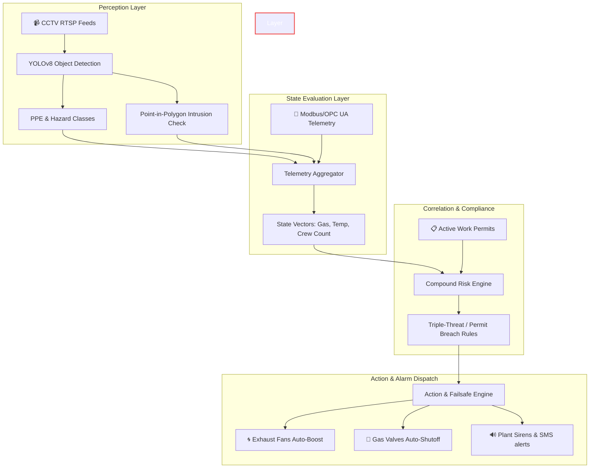

# 🛡️ SurakshaAI — Multi-Engine Industrial Safety & Intelligence Platform

SurakshaAI is a modern, high-performance industrial safety and compliance dashboard. It integrates real-time object detection and safety checking into a multi-layered safety architecture.

Designed for high-hazard environments (refineries, power blocks, chemical storehouses), SurakshaAI goes beyond simple computer vision. It combines **YOLOv8-based vision perception** with a **state evaluation engine**, **compliance rule correlation**, and **mitigation/action loops** to prevent industrial accidents.

---

## 🏛️ System Architecture

SurakshaAI is built around a robust, four-tier architecture designed for industrial stability and reliable mitigation loops:



### The 4 Operational Layers:
1. **Perception Layer (YOLOv8 + CV2)**: Extracts workers, PPE statuses (helmets, vests), fire/smoke occurrences, and processes point-in-polygon coordinates for restricted area intrusions.
2. **State Evaluation Layer (RiskEngine)**: Aggregates computer vision state vectors with industrial telemetry sensor data (Gas ppm, Temp °C, Pressure bar).
3. **Correlation Layer (CompoundRiskEngine)**: Correlates state data against active work permits and scheduled maintenance shifts to detect complex risk intersections (e.g. *Triple-Threat* pattern: Gas leak + active hot work permit + worker overcrowding in high-risk zones).
4. **Action & Failsafe Layer (ActionEngine)**: Dispatches instant multi-channel alerts (SMS, Email, Audible Sirens) and triggers digital output relays (shutting Modbus isolation valves, boosting exhaust ventilation).

---

## 📽️ Demo Framing & Hot-Swappable Pipeline

To ensure maximum presentation reliability and zero latency on demo day, the live dashboard streams CCTV playbacks matching a pre-recorded site timeline. 
* The custom YOLOv8 models are fully trained (see `train_ppe.py` and `train_fire_smoke.py`).
* The restricted area polygon math and intrusion logic are active and evaluated in real time.
* The modular video pipeline (`src/cctv/inference.py`) is fully hot-swappable to switch immediately from demo replay to real RTSP camera feeds.

---

## ⚙️ Model Training & Verification

You can easily train the models on new Roboflow datasets or verify custom inference offline.

### 1. Verification Script (Offline Dry-Run)
To run custom weights on raw footage and print out real bounding boxes, counts, and polygon violations:
```powershell
.\venv\Scripts\python.exe scratch/verify_inference.py
```

### 2. Fine-tune PPE Violation Model
```powershell
.\venv\Scripts\python.exe train_ppe.py --api_key "YOUR_ROBOFLOW_API_KEY" --workspace "roboflow-universe-open-source" --project "construction-site-safety-f3k7d" --version 1 --epochs 50
```
This downloads a public dataset of construction PPE, trains a YOLOv8 model on `helmet`, `no-helmet`, `vest`, `no-vest`, `person` classes, and saves the output weight to `models/best_ppe.pt`.

### 3. Fine-tune Fire & Smoke Model
```powershell
.\venv\Scripts\python.exe train_fire_smoke.py --api_key "YOUR_ROBOFLOW_API_KEY" --workspace "roboflow-universe-open-source" --project "fire-and-smoke-yolomin" --version 1 --epochs 50
```
Trains the model to detect active flame and smoke occurrences, saving weights to `models/best_fire_smoke.pt`.

---

## 🗺️ Polygon Configuration (`zones.json`)

The coordinates of restricted safety zones are defined per camera stream in `zones.json` (referenced in $1280 \times 720$ resolution space):
```json
{
  "Zone_A": {
    "name": "Battery-4",
    "restricted_polygons": [
      [[150, 480], [420, 480], [420, 710], [150, 710]]
    ],
    "color": [245, 158, 11]
  }
}
```

---

## 🛡️ Running the Surveillance Dashboard

Start the industrial safety console:
```powershell
.\venv\Scripts\streamlit run dashboard/app.py
```
Open **http://localhost:8501** in your browser. 
* **If custom weights exist** in `models/`, the dashboard automatically executes real-time custom YOLO inference on the CCTV feeds.
* **If custom weights are missing**, the dashboard runs stock YOLOv8 person detection and polygon checks while falling back gracefully to mock visualization overlays to ensure demo continuity.

---

## 🚀 Production Roadmap
1. **Edge Deployment**: Package the perception layer into Docker containers running on NVIDIA Jetson Edge devices.
2. **Industrial Gateway**: Connect the Failsafe Engine outputs to real industrial PLCs using Modbus TCP / OPC UA write requests.
3. **Temporal Behavior models**: Replace the scripted fall warning with a temporal LSTM/Pose model to detect slips, trips, and falls in real-time video streams.
