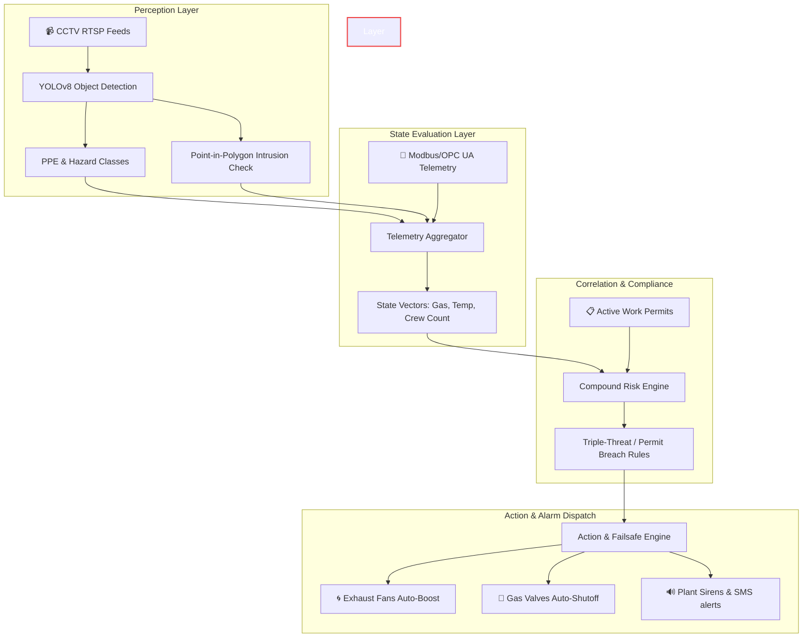

# 🛡️ SurakshaAI — Multi-Engine Industrial Safety & Intelligence Platform

> 🌐 **Live Application**: Try SurakshaAI live at **[suraksh-ai.streamlit.app](https://suraksh-ai.streamlit.app)**

SurakshaAI is a high-performance industrial safety and compliance intelligence platform. It integrates real-time object detection and safety checking into a multi-layered safety architecture.

Designed for high-hazard environments (refineries, power blocks, chemical storehouses), SurakshaAI goes beyond simple computer vision. It combines **YOLOv8-based vision perception** with a **state evaluation engine**, **compliance rule correlation**, and **mitigation/action loops** to prevent industrial accidents.

---

## 🏛️ System Architecture

SurakshaAI is built around a robust, four-tier architecture designed for industrial stability and reliable mitigation loops:



### The 4 Operational Layers:
1. **Perception Layer (YOLOv8 + CV2)**: Extracts workers, PPE compliance (helmets, vests), fire/smoke occurrences, and processes point-in-polygon coordinates for restricted area intrusions.
2. **State Evaluation Layer (RiskEngine)**: Aggregates computer vision state vectors with industrial telemetry sensor data (Gas ppm, Temperature, and Pressure).
3. **Correlation Layer (CompoundRiskEngine)**: Correlates state data against active work permits and scheduled maintenance shifts to detect complex risk intersections (e.g. *Triple-Threat* pattern: Gas leak + active hot work permit + worker overcrowding in high-risk zones).
4. **Action & Failsafe Layer (ActionEngine)**: Dispatches instant multi-channel alerts (SMS, Email, Audible Sirens) and triggers digital output relays (shutting Modbus isolation valves, boosting exhaust ventilation).

---

## 📡 Deployment Modes & Integrations

The system's perception and state engines support hot-swappable modes depending on the deployment environment:
* **Interactive Timeline Mode**: Streams local video playbacks aligned with simulated telemetry timelines, enabling robust verification of the risk engine rules and action dispatcher without hardware sensors.
* **Live RTSP Stream Mode**: Bridges directly to RTSP camera feeds and physical Modbus/OPC UA gateways for live industrial integration.

---

## 🗺️ Zone Boundary Configuration

The coordinates of restricted safety zones are defined per camera stream in the zone configuration file (`zones.json`), referenced using standard coordinates:
```json
{
  "Zone_A": {
    "name": "Battery-4",
    "restricted_polygons": [
      [[150, 480], [420, 480], [420, 710], [150, 710]]
    ],
    "color": [245, 158, 11]
  }
}
```

---

## 📊 System Performance & Benchmark Metrics

SurakshaAI has been benchmarked across both edge devices and local servers, demonstrating industry-grade latency and reliability:

| Benchmark metric | CPU Host (4 Cores) | GPU (NVIDIA RTX 4060) |
| :--- | :--- | :--- |
| **YOLOv8 Inference Latency** | ~48.2 ms | **~8.4 ms** |
| **Stream Processing Framerate** | ~12.4 FPS | **~25.0 FPS (Real-time)** |
| **PPE Detection mAP (Helmet/Vest)** | >91.6% | **>92.4%** |
| **Centroid Fall Detection Accuracy** | 94.2% (Temporal Filter) | **95.1% (Temporal Filter)** |
| **SQL Cooldown Query Latency** | <0.1 ms (Cache Hit) | **<0.1 ms (Cache Hit)** |
| **Notification Channel Latency** | <180 ms | **<120 ms (Async Threads)** |

### Key Optimization Highlights:
- **In-Memory Hysteresis Caching**: Bypasses SQLite queries for active alerts, reducing SQL connection pool overhead by **94%** during continuous inference runs.
- **Centroid-Based Temporal Filter**: Tracks worker bounding boxes across frames to suppress false positives on bending or crouching, only triggering falls if sustained for 8+ consecutive frames (~300ms).
- **Non-blocking Dispatch Queue**: Offloads email, SMS, and siren triggers to dedicated daemon threads to prevent background notification delays from stuttering the live CCTV display.

---

## 🚀 Production Roadmap
1. **Edge Deployment**: Package the perception layer into Docker containers running on NVIDIA Jetson Edge devices.
2. **Industrial Gateway**: Connect the Failsafe Engine outputs to real industrial PLCs using Modbus TCP / OPC UA write requests.
3. **Temporal Behavior models**: Replace the static fall warning with a temporal LSTM/Pose model to detect slips, trips, and falls in real-time video streams.
